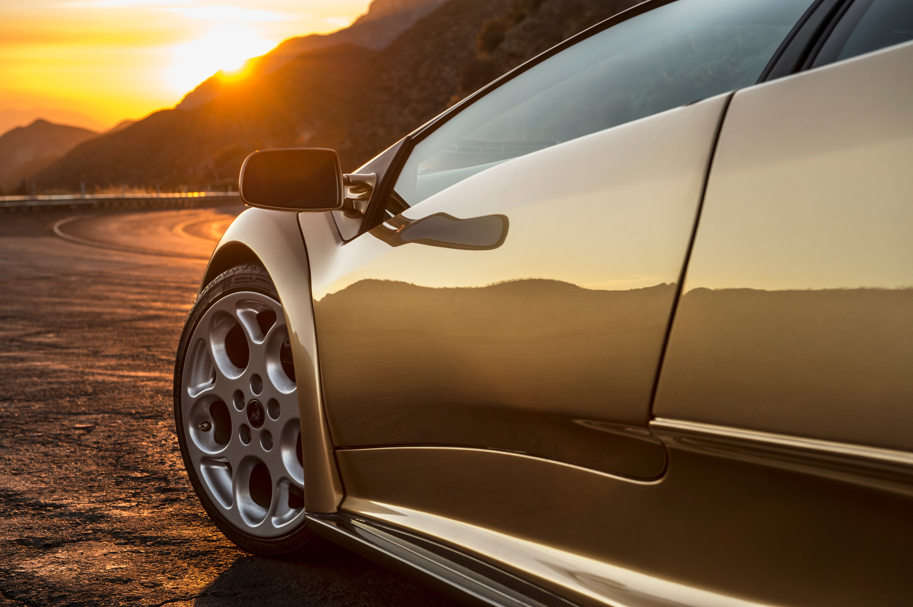

# Omarchy Diablo Dreams Theme

A dark, golden-brown theme for [Omarchy](https://omarchy.org) inspired by the
Lamborghini Diablo 6.0: warm cream text, muted bronze surfaces, and a dusty
terracotta accent.



## Install

```bash
omarchy theme install https://github.com/dhh/omarchy-diablo-dreams-theme
```

## Palette

| Role | Hex |
| --- | --- |
| Background | `#100e0a` |
| Dark background | `#0c0b08` |
| Darker background | `#080705` |
| Lighter background | `#282623` |
| Foreground | `#FEF2C9` |
| Accent | `#ab6a57` |
| Selection | `#FEF2C9` |
| Muted | `#635f59` |

Full ANSI palette in [`colors.toml`](colors.toml). Icons are `Yaru-wartybrown`.
